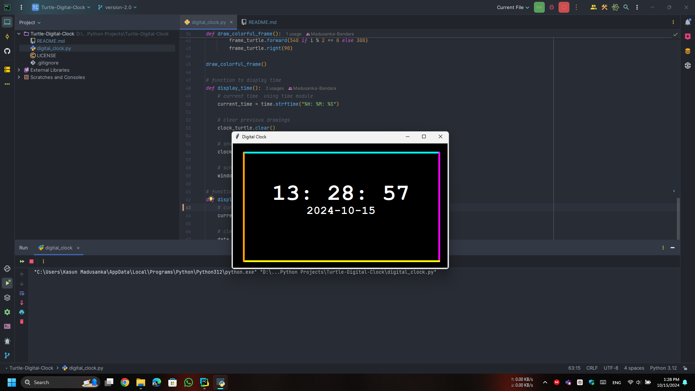

# Turtle-Digital-Clock
 This project builds a digital clock using Python's Turtle graphics library. The clock continuously updates every second to display the current time in HH:MM

## Features:
- Displays the current time in **HH:MM:SS** format.
- Date is shown below the time in **YYYY-MM-DD** format.
- The time updates every second.
- The date is updated once (no need for frequent updates).
- Colorful frame around the clock using different colors for each side.
- Customizable font, size, and color for both time and date.

## Screenshot:

  

